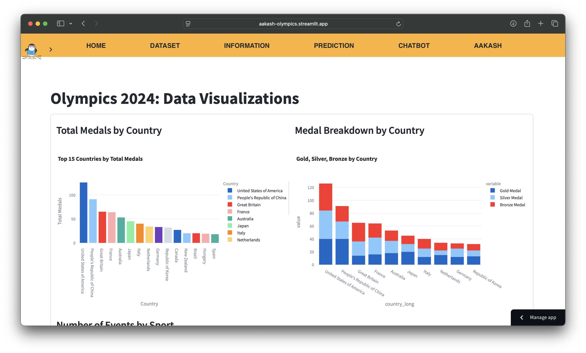

# 🏅 TechWill x Olympics


🔗 **Live Demo:** [TechWill x Olympics](https://aakash-olympics.streamlit.app/)  

[](https://youtu.be/6HVcoJIWzU0)

## 📘 Project Overview

The **Olympics 2024 Insight Platform** is a full-featured, cloud-integrated web application designed to provide interactive access to detailed data from the Paris 2024 Olympics. Built for athletes, analysts, and sports enthusiasts, the project enables users to:

- 📊 Explore real-time Olympic data across disciplines, athletes, and countries
- 🥇 Predict medal outcomes using simulation logic
- 🤖 Interact with an intelligent chatbot to retrieve event-specific insights
- ☁️ Access data efficiently via Google Cloud Platform for scalability and performance

This application is built using **Python** and **Streamlit**, with all datasets hosted on **Google Cloud Storage (GCS)**, ensuring robust cloud-native data handling and modular development.

---

## ☁️ Cloud Architecture & Data Pipeline

### ✅ Why Google Cloud Platform?

The application leverages **Google Cloud Platform (GCP)** as its backbone for storing and managing Olympic datasets. This cloud-native infrastructure ensures:

- **High Performance**: Fast retrieval of structured data using GCP Buckets
- **Scalability**: Seamless scaling of resources as the application and dataset sizes grow
- **Maintainability**: Decouples storage from compute logic, enhancing modular development
- **Accessibility**: Allows multiple application modules to securely and centrally access CSV files stored on the cloud

### 🔁 Workflow

1. **Data Upload**: Cleaned datasets are uploaded to GCP Cloud Storage buckets.
2. **Data Access**: The `cloud.py` module handles secure and efficient access to GCS from the Streamlit app.
3. **Processing**: Data is parsed, filtered, and visualized in real time within Streamlit pages.
4. **Usage**: Users interact with predictions, visualizations, and a chatbot to gain insights.

---

## 🗂️ Repository Structure

```
Olympics/
│
├── app.py                # Main Streamlit entry point
├── cloud.py              # GCP integration for loading CSVs from buckets
│
├── pages/                # Streamlit page logic
│   ├── home.py           # Landing page and app overview
│   ├── dataset_page.py   # Data explorer for athletes, medals, and events
│   ├── prediction.py     # Medal prediction simulation
│   ├── chatbot.py        # Natural language chatbot interface
│   ├── information.py    # Event details, schedules, venues
│   └── tutorial.py       # Video demonstrations
│
└── scripts/              # Discipline-specific data analysis
    ├── archery.py
    ├── golf.py
    └── wrestling.py
```

---

## 📊 Datasets

All datasets are sourced from official Olympic data feeds or publicly available structured repositories. These are stored in GCP and accessed dynamically within the app.

### 🗃️ Key Files

| File Name                | Description |
|--------------------------|-------------|
| `athletes.csv`           | Athlete profiles with discipline, country, birthdate, and participation (no weight data available) |
| `medals.csv`             | Official medal tally per athlete and country |
| `medallists.csv`         | Extended details on medal winners |
| `medals_total.csv`       | Summarized medal count per country (Gold, Silver, Bronze, Total) |
| `events.csv`             | Mapping of events to disciplines and URLs |
| `schedules.csv`          | Match timing, venues, and medal phases |
| `torch_route.csv`        | Torch relay locations and timeline |
| `technical_officials.csv`| Referees and technical officials with disciplines |
| `teams.csv`              | Team configurations and athletes per discipline |
| `coaches.csv`            | Coaching staff details |
| `venues.csv`             | Venue usage and sports allocations |
| `nocs.csv`               | National Olympic Committee codes and full names |
| `schedules_preliminary.csv` | Initial pre-event matchups and time blocks |

### 🎯 Sports Coverage

The dataset spans **45 Olympic disciplines**, including:

> Archery, Wrestling, Golf, Swimming, Athletics, Boxing, Badminton, Judo, Canoe Sprint, Basketball, Handball, Weightlifting, Equestrian, Water Polo, Breaking, Trampoline Gymnastics, Table Tennis, Artistic Gymnastics, Taekwondo, Fencing, and many more.

---

## 💡 Features in Detail

### 🥇 Medal Prediction Engine

- **Purpose**: Allow athletes and analysts to simulate expected medal outcomes based on current event participation and historical patterns.
- **Implementation**:
  - Input: Athlete name, event, or country
  - Logic: Rule-based heuristic modeling based on medals_total.csv and medallists.csv
  - Output: Simulated medal standing

### 📈 Dataset Visualization

- Interactive exploration of:
  - Athlete participation across countries and sports
  - Medal tallies by country, gender, and discipline
  - Venue usage timelines
  - Event-specific historical data

### 💬 Olympic Chatbot

- **Technology**: Powered by **Google Cloud APIs** and **Gemini (Google’s multimodal generative AI)** for intelligent, context-aware interaction
- **Architecture**:
  - Gemini handles natural language understanding and generation
  - Google Cloud Functions/API endpoints enable dynamic retrieval of structured data from GCP storage
- **Capabilities**:
  - 📆 **Answer complex event-specific queries**, such as:
    - "Who won gold in Judo?"
    - "What time is the Archery final?"
  - 🗺️ **Retrieve venue and location data** (e.g., where an event is being held)
  - 🏅 **Explain sport rules, athlete bios, and competition formats**
  - 🧠 Contextual memory: Understands follow-up questions in a conversation thread
- **Scalability**: As Gemini is hosted via Google Cloud, the chatbot benefits from scalability, low latency, and high availability

### 🌍 Event & Information Explorer

- Browse events by discipline or sport
- View schedules by date and venue
- Explore venue allocations across locations in France

---

## 🧰 Technology Stack

| Layer             | Tools Used |
|------------------|-------------|
| Frontend         | Streamlit |
| Backend          | Python, Pandas |
| Cloud Storage    | Google Cloud Storage |
| NLP Chatbot      | GCP API + Gemini|
| Deployment       | Streamlit Cloud |

---

## 🚀 How to Run

1. **Clone Repository**
```bash
git clone https://github.com/aakash-test7/Olympics.git
cd Olympics
```

2. **Install Requirements**
```bash
pip install -r requirements.txt
```

3. **Configure GCP Access**
- Set up a Google Cloud bucket
- Upload datasets to GCS
- Authenticate using a service account key (JSON)
- Update `cloud.py` with bucket name and file access logic

4. **Launch the App**
```bash
streamlit run app.py
```

---

## ✅ Conclusion

This project showcases how **Python-based data exploration**, **machine learning techniques**, and **cloud-native infrastructure** can be effectively combined to build an intelligent, interactive platform for large-scale global events like the Olympics.

By leveraging:

- **Google Cloud Platform** for scalable data storage and seamless integration with AI services (such as Gemini for chatbot capabilities),
- **Streamlit** for rapid and responsive user interface development,
- and **custom analytics and simulations** for predicting medal outcomes,

the platform offers a powerful toolkit for athletes, analysts, and fans alike to access, understand, and interact with complex Olympic data.

It exemplifies how cloud-enabled data solutions can transform static datasets into **dynamic, insight-driven tools** — enabling smarter decision-making, better fan engagement, and inclusive access to rich, global sporting content.

---
